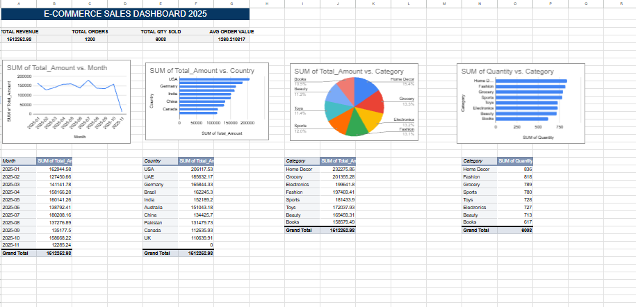

# E-Commerce Sales Analytics Dashboard 2025

## Objective
Analyze e-commerce sales data to identify revenue trends, top-performing products, and regional performance.

## Tools
- Google Sheets (Data Cleaning, Pivot Tables, Dashboard)

## Dataset
Global E-Commerce Sales Dataset 2025 — 1,200 orders, 7 columns.

Columns: Order_ID, Country, Category, Unit_Price, Quantity, Order_Date, Total_Amount

## Key Findings
1. Total revenue: $151,252.98
2. Total orders: 1,200
3. Total quantity sold: 6,008
4. Average order value: $126.04
5. Top country by revenue: USA ($206,177.53)
6. Top category by revenue: Home Decor ($327,275.86)
7. Highest revenue month: January 2025 ($162,944.58)
8. Lowest revenue month: November 2025 ($12,285.24)

## Dashboard

## Project Structure
- `dashboard.png` — Screenshot of the final dashboard
- `ecommerce_sales.xlsx` — Cleaned data with pivot tables and dashboard

## What I Did
1. Imported and cleaned 1,200 rows of e-commerce transaction data in Google Sheets.
2. Built 6 pivot tables to analyze revenue by country, category, and month.
3. Created KPI cards for Total Revenue, Total Orders, Total Quantity, and Average Order Value.
4. Built 4 charts: monthly revenue trend (line), revenue by country (bar), revenue by category (pie), and quantity by category (bar).

## Key Insights
- The USA is the highest revenue-generating country, followed by UAE and Germany.
- Home Decor is the top-performing category by revenue.
- Revenue peaked in January 2025 and dropped significantly in November 2025.
- Average order value is $126.04 across 1,200 orders.
